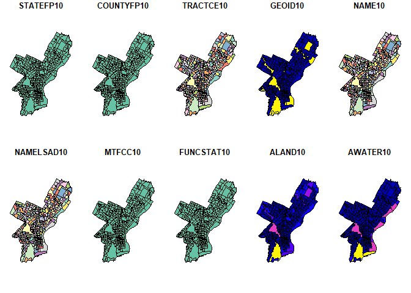
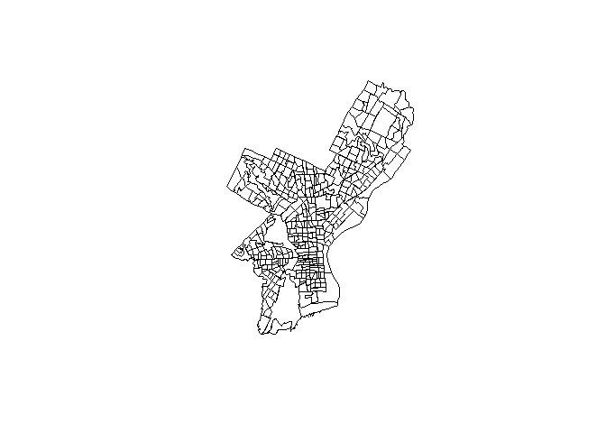
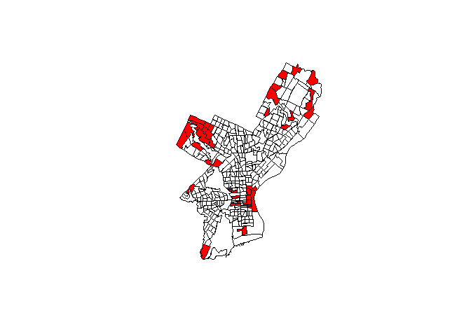
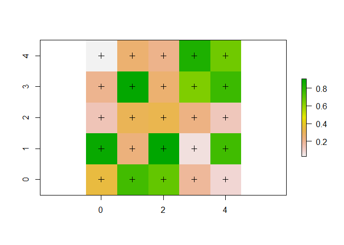
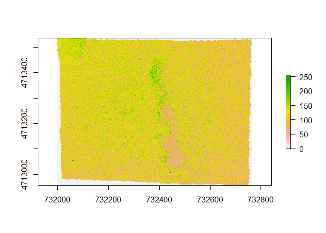
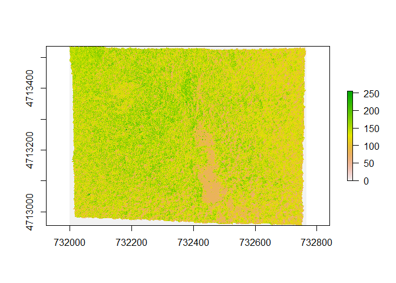
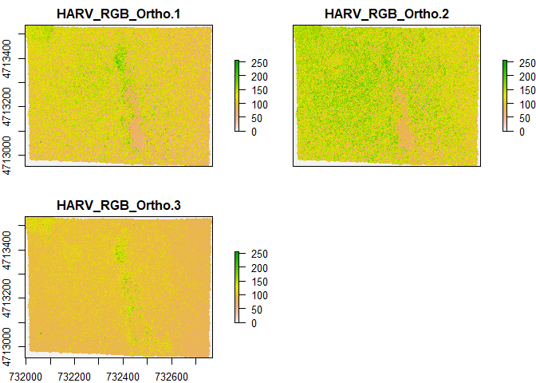
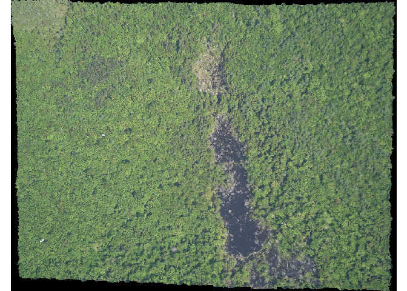

Intro to spatial object
================

``` r
library(sp)
```

    ## Warning: package 'sp' was built under R version 4.2.1

``` r
library(sf)
```

    ## Linking to GEOS 3.9.1, GDAL 3.3.2, PROJ 7.2.1; sf_use_s2() is TRUE

## Conceptualizing spa)tial vector objects in R

The foundational structure for any spatial object in {sp} is the
`Spatial` class with two slots

-   a bounding box
-   a CRS class object to define CRS (Coordinate Reference System)

To manually build up a spatial object, the steps are:

1.  Create geometric objects (Points, Lines, Polygons)

-   Points: generated out of either a single coordinate or set of
    coordinates, like two column matrix or dataframe with columns for
    latitude and longitude.

-   Lines: generated out of `Line` objects and `Line` object is a
    collection of 2D coordinates and generated out of a two column
    matrix or dataframe with one column for latitude and one column for
    longitude. so a `Lines` object is a list of one or more `Line`
    objects, for example all the contours at a single elevation.

-   Polygons: generated out of `Polygon` objects which is a collection
    of 2D coordinates with equal first and last coordinates and is
    generated out of a two column matrix and dataframe with columns for
    latitude and longitude. So a `Polygons` object is a list of one or
    more `Polygon` objects, say, islands belonging to the same country

2.  Create spatial objects (SpatialPoints, SpatialLines,
    SpatialPolygons)

This step adds the bounding box (automatically) and slot for CRS (which
needs to be filled manually)

3.  Add attributes (Optional)

If we add a dataframe with attribute data, then SpatialPoints would be a
SpatialPointsDataFrame object, similarly we would have
SpatialLinesDataFrame, SpatialPolygonsDataFrame objects

## Example (creating a sp object that contains highways)

``` r
# First we would create a `Line` object that holds one highway.
ln1 <- Line(matrix(runif(6), ncol = 2)) # 1st highway
ln2 <- Line(matrix(runif(6), ncol = 2)) # 2nd highway

# then create the Lines object for the two highway
lns1 <- Lines(list(ln1), ID = c("hw1"))
lns2 <- Lines(list(ln2), ID = c("hw2"))

# turn lines into a geospatial object
sp_lns <- SpatialLines(list(lns1, lns2))

dfr <- data.frame(id = c("hw1", "hw2"),
                  cars_par_hour = c(78, 22))

sp_lns_dfr <- SpatialLinesDataFrame(sp_lns, dfr, match.ID = "id")
```

## The {sf} package

`sf` implements a formal standard called “Simple features” that
specifies the storage and access model of Spatial Geometries (point,
line, polygon)

In `sf` spatial objects are stored as a simple data frame with a special
column that contains the information for the geometry coordinates. That
special column is a list with the same length as the number of rows in
the data frame and each of the individual elements of that column can by
of any length needed to hold the coordinates that corresponds to an
individual feature.

To create a `sf` object manually, the steps are:

1.  Create geometric objects (point, line, polygon)

-   Geometric object (simple features) can be created from a numeric
    vector, matrix or a list with the coordinates. They are called `sfg`
    (simple feature geometry). we can use `st_point()`,
    `st_linestring()`, `st_polygon()` to create these simple features.

2.  Combine all the individual single feature objects for the special
    column

-   feature geometries are combined into a simple feature collection
    (sfc) using `st_sfc()`. The sfc object also holds the bbox and
    projection information.

3.  Add attributes with st_sf()

-   st_sf() extends the well known R data.frame with a column that hold
    sfc

## Example (creating a sf object that contains highways)

``` r
lnstr_sfg1 <- st_linestring(matrix(runif(6), ncol = 2))
lnstr_sfg2 <- st_linestring(matrix(runif(6), ncol = 2))

lnstr_sfc <- st_sfc(lnstr_sfg1, lnstr_sfg2)
lnstr_sfc
```

    ## Geometry set for 2 features 
    ## Geometry type: LINESTRING
    ## Dimension:     XY
    ## Bounding box:  xmin: 0.08750478 ymin: 0.1183227 xmax: 0.965175 ymax: 0.6286509
    ## CRS:           NA

    ## LINESTRING (0.9605726 0.1183227, 0.1796073 0.59...

    ## LINESTRING (0.8376721 0.4715785, 0.8528408 0.62...

``` r
lnstr_sf <- st_sf(dfr, lnstr_sfc)
lnstr_sf
```

    ## Simple feature collection with 2 features and 2 fields
    ## Geometry type: LINESTRING
    ## Dimension:     XY
    ## Bounding box:  xmin: 0.08750478 ymin: 0.1183227 xmax: 0.965175 ymax: 0.6286509
    ## CRS:           NA
    ##    id cars_par_hour                      lnstr_sfc
    ## 1 hw1            78 LINESTRING (0.9605726 0.118...
    ## 2 hw2            22 LINESTRING (0.8376721 0.471...

## Challange

Similarly to the example above generate a Point object in R. Use both,
the sp and the sf “approach”.

1.  Create a matrix pts of random numbers with two columns and as many
    rows as you like. These are your points.
2.  Create a dataframe attrib_df with the same number of rows as your
    pts matrix and a column that holds an attribute. You can make up any
    attribute.
3.  Use the appropriate commands and pts to create

-   a SpatialPointsDataFrame and
-   an sf object with a gemoetry column of class sfc_POINT.

4.  Try to subset your spatial object using the attribute you have added
    and the way you are used to from regular data frames.
5.  How do you determine the bounding box of your spatial object?

``` r
pts <- matrix(runif(10), ncol = 2)
attrib_df <- data.frame(popn = sample(50:90, size = nrow(pts)))

# using sp
sp_pts_dfr <- SpatialPointsDataFrame(pts, attrib_df)
sp_pts_dfr
```

    ##                coordinates popn
    ## 1   (0.7574618, 0.7075076)   62
    ## 2   (0.8560767, 0.8238963)   59
    ## 3   (0.9620693, 0.8841438)   66
    ## 4 (0.08689782, 0.03013727)   64
    ## 5    (0.469719, 0.1748378)   84

``` r
# using sf
pts_sf <- cbind(attrib_df, data.frame(pts)) |> st_as_sf(coords = c(2, 3))
```

## Creating a Spatial object from a lat/lon table

### Using {Sf}

An `sf` object can be created from a data frame using `st_as_sf()`

``` r
philly_homicides_df <- readr::read_csv("data/philly_homicides.csv")
```

    ## Rows: 3883 Columns: 10
    ## ── Column specification ────────────────────────────────────────────────────────
    ## Delimiter: ","
    ## chr  (3): SECTOR, LOCATION_BLOCK, TEXT_GENERAL_CODE
    ## dbl  (5): DC_DIST, UCR_GENERAL, OBJ_ID, POINT_X, POINT_Y
    ## date (1): DISPATCH_DATE
    ## time (1): DISPATCH_TIME
    ## 
    ## ℹ Use `spec()` to retrieve the full column specification for this data.
    ## ℹ Specify the column types or set `show_col_types = FALSE` to quiet this message.

``` r
philly_homicides_sf <- st_as_sf(philly_homicides_df,
                                coords = c("POINT_X", "POINT_Y"))
```

To have a complete geo object we need to set a CRS. we assign the WGS84
projection which has the EPSG code 4326.

On a side note: full form of EPSG is “European Petrolium Survey Group”

``` r
st_crs(philly_homicides_sf)
```

    ## Coordinate Reference System: NA

``` r
st_crs(philly_homicides_sf) <- 4326
```

To save the sf object as a shapefile we use `st_write()`

``` r
st_write(philly_homicides_sf, "data/PhillyHomicides", driver = "ESRI Shapefile", delete_layer = TRUE)
```

    ## Warning in abbreviate_shapefile_names(obj): Field names abbreviated for ESRI
    ## Shapefile driver

    ## Warning in clean_columns(as.data.frame(obj), factorsAsCharacter): Dropping
    ## column(s) DISPATCH_T of class(es) hms;difftime

    ## Deleting layer `PhillyHomicides' using driver `ESRI Shapefile'
    ## Writing layer `PhillyHomicides' to data source 
    ##   `data/PhillyHomicides' using driver `ESRI Shapefile'
    ## Writing 3883 features with 7 fields and geometry type Point.

### Using {sp})

A SpatialPointsDataFrame object can be create directly from a dataframe
by specifing which columns contain the coordinates and this is can be
done with `coordinates()` function and **this approach replaces the
original data frame** so be warned.

``` r
philly_homicides_df <- subset(philly_homicides_df, select = -c(DISPATCH_TIME))

coordinates(philly_homicides_df) <- c("POINT_X", "POINT_Y")

class(philly_homicides_df)
```

    ## [1] "SpatialPointsDataFrame"
    ## attr(,"package")
    ## [1] "sp"

``` r
# assigning the projection

is.projected(philly_homicides_df)
```

    ## [1] NA

``` r
proj4string(philly_homicides_df) <- CRS("+init=epsg:4326")
```

To save this sp object

``` r
library(rgdal, quietly = TRUE)
```

    ## Warning: package 'rgdal' was built under R version 4.2.1

    ## Please note that rgdal will be retired by the end of 2023,
    ## plan transition to sf/stars/terra functions using GDAL and PROJ
    ## at your earliest convenience.
    ## 
    ## rgdal: version: 1.5-32, (SVN revision 1176)
    ## Geospatial Data Abstraction Library extensions to R successfully loaded
    ## Loaded GDAL runtime: GDAL 3.4.3, released 2022/04/22
    ## Path to GDAL shared files: C:/Users/User/AppData/Local/R/win-library/4.2/rgdal/gdal
    ## GDAL binary built with GEOS: TRUE 
    ## Loaded PROJ runtime: Rel. 7.2.1, January 1st, 2021, [PJ_VERSION: 721]
    ## Path to PROJ shared files: C:/Users/User/AppData/Local/R/win-library/4.2/rgdal/proj
    ## PROJ CDN enabled: FALSE
    ## Linking to sp version:1.5-0
    ## To mute warnings of possible GDAL/OSR exportToProj4() degradation,
    ## use options("rgdal_show_exportToProj4_warnings"="none") before loading sp or rgdal.

``` r
writeOGR(philly_homicides_df, "data/PhillyHomicides", "PhillyHomicides", driver = "ESRI Shapefile", overwrite_layer = TRUE)
```

    ## Warning in writeOGR(philly_homicides_df, "data/PhillyHomicides",
    ## "PhillyHomicides", : Field names abbreviated for ESRI Shapefile driver

> `writeOGR()` cannot convert data of class `hms`. So had to remove
> DISPATCH_TIME column just to avoid digggin in right now. But have to
> check a solution for this later.

## Loading Shape files

### Using sf

``` r
philly_sf <- st_read("data/Philly")
```

    ## Reading layer `PhillyTotalPopHHinc' from data source 
    ##   `C:\Users\User\Desktop\R-desk\R_spatial\data\Philly' using driver `ESRI Shapefile'
    ## Simple feature collection with 384 features and 17 fields
    ## Geometry type: MULTIPOLYGON
    ## Dimension:     XY
    ## Bounding box:  xmin: 1739497 ymin: 457343.7 xmax: 1764030 ymax: 490544.9
    ## Projected CRS: Albers

As a side note: you can turn a sf dataframe back to normal non spatial
dataframe using `st_drop_geometry()`

``` r
plot(philly_sf)
```

    ## Warning: plotting the first 10 out of 17 attributes; use max.plot = 17 to plot
    ## all

<!-- -->

In order to plot only the polygon boundaries we need to specify to
directly use geometry column with `st_geometry`

``` r
plot(st_geometry(philly_sf))
```

<!-- -->

To get only the polygons for which median income is \> 60000 (actually
we are adding layers on the original boundaries)

``` r
philly_sf_rich <- subset(philly_sf, medHHinc > 60000)

plot(st_geometry(philly_sf))
plot(st_geometry(philly_sf_rich), add = TRUE, col = "red")
```

<!-- -->

> A little side note to the future you: you need to run the previous
> chunk (those three lines) together to get the above plot.

### loading shapefile with {sp}

In order to read spatial data into R and to turn them into Spatial\*
family objects we require `rgdal` package which provides bindings to
GDAL.

> GDAL also known as GDAL/OGR, is a library of tools used for
> manipulating geospatial data (for both raster and vector data types)
> and its a open-source geospatial data IO library. GDAL supports over
> 200 raster formats and vector formats. We can use `ogrDrivers()` and
> `gdalDrivers()` to see which vector and raster formats `rgdal`
> supports.

We can read in and write out spatial data using

    readOGR() and writeOGR() for vector format
    readGDAL() and writeGDAL() for raster format

> A shapefile consists of various files of the same name but with
> different extensions. Shapefile consists of a collection of files with
> a common filename prefix, stored in the same directory. The three
> mandatory files have filename extensions `.shp`, `.shx`, `.dbf`. The
> actual shapefile relates specifically to the `.shp` file, but alone is
> incomplete for distribution as the other supporting files are
> required.

**Mandatory files** - `.shp` - shape format: the feature geometry
itself - `.shx` - shape index format: a positional index of the feature
geometry to allow seeking forwards and backwards - `.dbf` - attribute
format

**Other files** `.prj` - projection description

When reading in a shapefile `readOGR()` requires the following two
arguments:

    datasource name (dsn) => the path to the folder that contain the files. 
                             this is a path to the folder, not a filename !!.

    layer name (layer) =>    the shapefile name WITHOUT extension
                             this is not a path but just the name of the file !!

``` r
library(rgdal, quietly = TRUE)

philly_sp <- readOGR("data/Philly", "PhillyTotalPopHHinc")
```

    ## OGR data source with driver: ESRI Shapefile 
    ## Source: "C:\Users\User\Desktop\R-desk\R_spatial\data\Philly", layer: "PhillyTotalPopHHinc"
    ## with 384 features
    ## It has 17 fields

``` r
class(philly_sp)
```

    ## [1] "SpatialPolygonsDataFrame"
    ## attr(,"package")
    ## [1] "sp"

``` r
plot(philly_sp)

philly_sp_rich <- subset(philly_sp, medHHinc > 60000)

plot(philly_sp_rich, add = TRUE, col = "red")
```

<!-- -->

> A little side note to the future you: you need to run the previous
> chunk (those three lines) together to get the above plot.

## Raster Data in R

Raster files have a much more compact data structure than vectors.
Because of their regular structure, coordinates do not need to be
recorded for each pixel or cell.

A raster is defined by

-   a CRS
-   a coordinates of its origin
-   a distance or cell size in each direction
-   a dimension or number of cells in each direction
-   an array of cell values

Given this structure, coordinates for any cell can be computed

> Conversion from sp type to raster type is possible

### Creating a raster object

``` r
library(raster)
```

    ## Warning: package 'raster' was built under R version 4.2.1

``` r
r <- raster(xmn = -0.5, ymn = -0.5, xmx = 4.5, ymx = 4.5, res = c(1,1))
r
```

    ## class      : RasterLayer 
    ## dimensions : 5, 5, 25  (nrow, ncol, ncell)
    ## resolution : 1, 1  (x, y)
    ## extent     : -0.5, 4.5, -0.5, 4.5  (xmin, xmax, ymin, ymax)
    ## crs        : +proj=longlat +datum=WGS84 +no_defs

If x coordinates are withing -360 to 360 and y coordinates are within
-90 to 90, then WGS84 projection is used by default.

``` r
class(r)
```

    ## [1] "RasterLayer"
    ## attr(,"package")
    ## [1] "raster"

``` r
r <- setValues(r, runif(25))

plot(r)
points(coordinates(r), pch = 3)
```

<!-- -->

### creating raster from matrix

``` r
class(volcano)
```

    ## [1] "matrix" "array"

``` r
volcano.r <- raster(volcano)

class(volcano.r)
```

    ## [1] "RasterLayer"
    ## attr(,"package")
    ## [1] "raster"

### reading raster from a file

``` r
HARV <- raster("data/HARV_RGB_Ortho.tif")

HARV # An RasterLayer object
```

    ## class      : RasterLayer 
    ## band       : 1  (of  3  bands)
    ## dimensions : 2317, 3073, 7120141  (nrow, ncol, ncell)
    ## resolution : 0.25, 0.25  (x, y)
    ## extent     : 731998.5, 732766.8, 4712956, 4713536  (xmin, xmax, ymin, ymax)
    ## crs        : +proj=utm +zone=18 +datum=WGS84 +units=m +no_defs 
    ## source     : HARV_RGB_Ortho.tif 
    ## names      : HARV_RGB_Ortho 
    ## values     : 0, 255  (min, max)

``` r
plot(HARV)
```

<!-- -->

``` r
ncell(HARV)
```

    ## [1] 7120141

``` r
crs(HARV)
```

    ## Coordinate Reference System:
    ## Deprecated Proj.4 representation:
    ##  +proj=utm +zone=18 +datum=WGS84 +units=m +no_defs 
    ## WKT2 2019 representation:
    ## PROJCRS["WGS 84 / UTM zone 18N",
    ##     BASEGEOGCRS["WGS 84",
    ##         DATUM["World Geodetic System 1984",
    ##             ELLIPSOID["WGS 84",6378137,298.257223563,
    ##                 LENGTHUNIT["metre",1]]],
    ##         PRIMEM["Greenwich",0,
    ##             ANGLEUNIT["degree",0.0174532925199433]],
    ##         ID["EPSG",4326]],
    ##     CONVERSION["UTM zone 18N",
    ##         METHOD["Transverse Mercator",
    ##             ID["EPSG",9807]],
    ##         PARAMETER["Latitude of natural origin",0,
    ##             ANGLEUNIT["degree",0.0174532925199433],
    ##             ID["EPSG",8801]],
    ##         PARAMETER["Longitude of natural origin",-75,
    ##             ANGLEUNIT["degree",0.0174532925199433],
    ##             ID["EPSG",8802]],
    ##         PARAMETER["Scale factor at natural origin",0.9996,
    ##             SCALEUNIT["unity",1],
    ##             ID["EPSG",8805]],
    ##         PARAMETER["False easting",500000,
    ##             LENGTHUNIT["metre",1],
    ##             ID["EPSG",8806]],
    ##         PARAMETER["False northing",0,
    ##             LENGTHUNIT["metre",1],
    ##             ID["EPSG",8807]]],
    ##     CS[Cartesian,2],
    ##         AXIS["(E)",east,
    ##             ORDER[1],
    ##             LENGTHUNIT["metre",1]],
    ##         AXIS["(N)",north,
    ##             ORDER[2],
    ##             LENGTHUNIT["metre",1]],
    ##     USAGE[
    ##         SCOPE["Engineering survey, topographic mapping."],
    ##         AREA["Between 78°W and 72°W, northern hemisphere between equator and 84°N, onshore and offshore. Bahamas. Canada - Nunavut; Ontario; Quebec. Colombia. Cuba. Ecuador. Greenland. Haiti. Jamica. Panama. Turks and Caicos Islands. United States (USA). Venezuela."],
    ##         BBOX[0,-78,84,-72]],
    ##     ID["EPSG",32618]]

``` r
## to get the metadata about a raster file
rgdal::GDALinfo("data/HARV_RGB_Ortho.tif")
```

    ## rows        2317 
    ## columns     3073 
    ## bands       3 
    ## lower left origin.x        731998.5 
    ## lower left origin.y        4712956 
    ## res.x       0.25 
    ## res.y       0.25 
    ## ysign       -1 
    ## oblique.x   0 
    ## oblique.y   0 
    ## driver      GTiff 
    ## projection  +proj=utm +zone=18 +datum=WGS84 +units=m +no_defs 
    ## file        data/HARV_RGB_Ortho.tif 
    ## apparent band summary:
    ##    GDType hasNoDataValue NoDataValue blockSize1 blockSize2
    ## 1 Float64           TRUE   -1.7e+308          1       3073
    ## 2 Float64           TRUE   -1.7e+308          1       3073
    ## 3 Float64           TRUE   -1.7e+308          1       3073
    ## apparent band statistics:
    ##   Bmin Bmax Bmean Bsd
    ## 1    0  255   NaN NaN
    ## 2    0  255   NaN NaN
    ## 3    0  255   NaN NaN
    ## Metadata:
    ## AREA_OR_POINT=Area

A raster dataset can contain one or more bands. To know the number of
band,

``` r
nlayers(HARV)
```

    ## [1] 1

But note that from `GDALinfo` we see that there are 3 bands, to get more
of these bands, we can specify while reading raster data

``` r
HARV_2 <- raster("data/HARV_RGB_Ortho.tif", band = 2)
HARV_2 # look at the `band` 
```

    ## class      : RasterLayer 
    ## band       : 2  (of  3  bands)
    ## dimensions : 2317, 3073, 7120141  (nrow, ncol, ncell)
    ## resolution : 0.25, 0.25  (x, y)
    ## extent     : 731998.5, 732766.8, 4712956, 4713536  (xmin, xmax, ymin, ymax)
    ## crs        : +proj=utm +zone=18 +datum=WGS84 +units=m +no_defs 
    ## source     : HARV_RGB_Ortho.tif 
    ## names      : HARV_RGB_Ortho 
    ## values     : 0, 255  (min, max)

``` r
# HARV_2 is an RasterLayer object

plot(HARV_2)
```

<!-- -->

To get all of the bands

``` r
HARV_stack <- stack("data/HARV_RGB_Ortho.tif")

nlayers(HARV_stack)
```

    ## [1] 3

``` r
HARV_stack # its an RasterStack object
```

    ## class      : RasterStack 
    ## dimensions : 2317, 3073, 7120141, 3  (nrow, ncol, ncell, nlayers)
    ## resolution : 0.25, 0.25  (x, y)
    ## extent     : 731998.5, 732766.8, 4712956, 4713536  (xmin, xmax, ymin, ymax)
    ## crs        : +proj=utm +zone=18 +datum=WGS84 +units=m +no_defs 
    ## names      : HARV_RGB_Ortho.1, HARV_RGB_Ortho.2, HARV_RGB_Ortho.3 
    ## min values :                0,                0,                0 
    ## max values :              255,              255,              255

``` r
plot(HARV_stack)
```

<!-- -->

If we know its an RGB multiband raster we can plot them all in one

``` r
plotRGB(HARV_stack)
```

<!-- -->

## RasterStack vs RasterBrick

These both can store multiple bands but

-   RasterStack stores links to raster data that is located somewhere on
    our computer, thats why its object size is small
-   RasterBrick stores all the object as an R object. That’s why its
    object.size is larger than the RasterStack object
-   But RasterBrick is often more efficient and faster to process which
    is important for large datafiles.

``` r
#library(lobstr)

lobstr::obj_size(HARV_stack)
```

    ## 19.44 kB

``` r
# converting to rasterbrick

HARV_brick <- brick(HARV_stack)

lobstr::obj_size(HARV_brick)
```

    ## 14.03 kB

## Ehh!! Confusing…….
