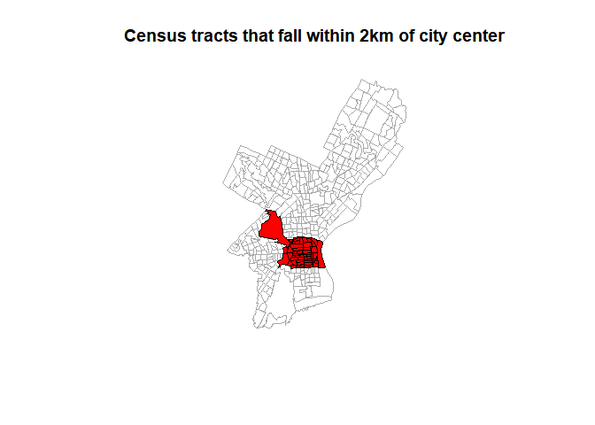
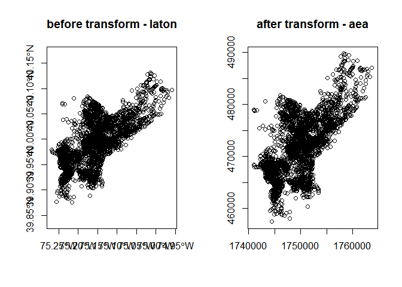

Spatial Data Manipulation in R
================

## Attribute Join in sf

Its the process of joining data in tabular format to a data in a format
that holds geometries (point, line, polygon)

``` r
library(sf)
```

    ## Linking to GEOS 3.9.1, GDAL 3.3.2, PROJ 7.2.1; sf_use_s2() is TRUE

``` r
ph_edu <- read.csv("data/PhillyEducation.csv")
names(ph_edu)
```

    ##  [1] "GEOID"           "NAME"            "fem_bachelor"    "fem_doctorate"  
    ##  [5] "fem_highschool"  "fem_noschool"    "fem_ovr_25"      "male_bachelor"  
    ##  [9] "male_doctorate"  "male_highschool" "male_noschool"   "male_ovr_25"    
    ## [13] "pop_ovr_25"

``` r
philly_sf <- st_read("data/Philly/")
```

    ## Reading layer `PhillyTotalPopHHinc' from data source 
    ##   `C:\Users\User\Desktop\R-desk\R_spatial\data\Philly' using driver `ESRI Shapefile'
    ## Simple feature collection with 384 features and 17 fields
    ## Geometry type: MULTIPOLYGON
    ## Dimension:     XY
    ## Bounding box:  xmin: 1739497 ymin: 457343.7 xmax: 1764030 ymax: 490544.9
    ## Projected CRS: Albers

``` r
names(philly_sf)
```

    ##  [1] "STATEFP10"  "COUNTYFP10" "TRACTCE10"  "GEOID10"    "NAME10"    
    ##  [6] "NAMELSAD10" "MTFCC10"    "FUNCSTAT10" "ALAND10"    "AWATER10"  
    ## [11] "INTPTLAT10" "INTPTLON10" "GISJOIN"    "Shape_area" "Shape_len" 
    ## [16] "medHHinc"   "totalPop"   "geometry"

So merging by `GEOID10` which is same as `GEOID`

``` r
philly_sf_merged <- merge(philly_sf, ph_edu, by.x = "GEOID10", by.y = "GEOID")

names(philly_sf_merged)
```

    ##  [1] "GEOID10"         "STATEFP10"       "COUNTYFP10"      "TRACTCE10"      
    ##  [5] "NAME10"          "NAMELSAD10"      "MTFCC10"         "FUNCSTAT10"     
    ##  [9] "ALAND10"         "AWATER10"        "INTPTLAT10"      "INTPTLON10"     
    ## [13] "GISJOIN"         "Shape_area"      "Shape_len"       "medHHinc"       
    ## [17] "totalPop"        "NAME"            "fem_bachelor"    "fem_doctorate"  
    ## [21] "fem_highschool"  "fem_noschool"    "fem_ovr_25"      "male_bachelor"  
    ## [25] "male_doctorate"  "male_highschool" "male_noschool"   "male_ovr_25"    
    ## [29] "pop_ovr_25"      "geometry"

## Attribute joins in sp

``` r
philly_sp <- rgdal::readOGR("data/Philly/", "PhillyTotalPopHHinc")
```

    ## OGR data source with driver: ESRI Shapefile 
    ## Source: "C:\Users\User\Desktop\R-desk\R_spatial\data\Philly", layer: "PhillyTotalPopHHinc"
    ## with 384 features
    ## It has 17 fields

``` r
philly_sp_merged <- merge(philly_sp, ph_edu, by.x = "GEOID10", by.y = "GEOID")
names(philly_sp_merged)
```

    ##  [1] "GEOID10"         "STATEFP10"       "COUNTYFP10"      "TRACTCE10"      
    ##  [5] "NAME10"          "NAMELSAD10"      "MTFCC10"         "FUNCSTAT10"     
    ##  [9] "ALAND10"         "AWATER10"        "INTPTLAT10"      "INTPTLON10"     
    ## [13] "GISJOIN"         "Shape_area"      "Shape_len"       "medHHinc"       
    ## [17] "totalPop"        "NAME"            "fem_bachelor"    "fem_doctorate"  
    ## [21] "fem_highschool"  "fem_noschool"    "fem_ovr_25"      "male_bachelor"  
    ## [25] "male_doctorate"  "male_highschool" "male_noschool"   "male_ovr_25"    
    ## [29] "pop_ovr_25"

## Topological subsetting (select polygons by Location)

we want to select all Philadelphia census tracts within a range of 2
kilometers from the city center.

The steps could be

1.  Get the census tract polygons
2.  Find the philadelphia city center coordinates
3.  create a buffer around the city center point
4.  select all the census tract polygons that intersects with the center
    buffer.

### Using sf package

So for first step, we have `philly_sf` as census tract polygons. And for
the 2nd step, we need to create a `sf` point object with the
philadelphia city center coordinates, which are,
`x = 1750160, y = 467499.9`.

``` r
philly_center_sfc <- st_sfc(st_point(c(1750160, 467499.9)), crs = "ESRI:102003")
```

Next, we create a 2km buffer around the city center point.

``` r
philly_buf_sf <- st_buffer(philly_center_sfc, 2000)

philly_buf_sf
```

    ## Geometry set for 1 feature 
    ## Geometry type: POLYGON
    ## Dimension:     XY
    ## Bounding box:  xmin: 1748160 ymin: 465499.9 xmax: 1752160 ymax: 469499.9
    ## Projected CRS: USA_Contiguous_Albers_Equal_Area_Conic

    ## POLYGON ((1752160 467499.9, 1752157 467395.2, 1...

Now we can use that buffer to select all census tract polygons that
intersect with that buffer and for that we can use `st_intersect` which
returns a logical vector which we can use later for subsetting.

``` r
philly_buf_intersects <- st_intersects(philly_buf_sf, philly_sf)

st_crs(philly_sf)[1]
```

    ## $input
    ## [1] "Albers"

``` r
st_crs(philly_buf_sf)[1]
```

    ## $input
    ## [1] "ESRI:102003"

``` r
st_crs(philly_sf) <- "ESRI:102003"

philly_buf_intersects <- st_intersects(philly_buf_sf, philly_sf)

class(philly_buf_intersects)
```

    ## [1] "sgbp" "list"

> sgbp is a sparse geometry binary predicate. which is a list with
> integer vectors only holding the indices for each polygon that
> intersects.

In our case we have only one vector, because we only intersect with one
buffer polygon, which we can extract using `philly_buf_intersects[[1]]`
and use it for subsetting.

``` r
philly_sel_sf <- philly_sf[philly_buf_intersects[[1]], ] #subsetting rows

plot(st_geometry(philly_sf), border = "#aaaaaa",
     main = "Census tracts that fall within 2km of city center")
plot(st_geometry(philly_sel_sf), add = TRUE, col = "red")
plot(st_geometry(philly_buf_sf), add = TRUE)
```

<!-- -->

## Reprojecting

we can reproject a spatial object to a new CRS with

-   a `sf` object with `st_transform()`
-   a `raster` object with `projectRaster()`

We can retrieve the crs from a spatial object

-   from an `sf` object with `st_crs()`
-   from a `raster` object with `crs()`

``` r
philly_homicides_sf <- st_read("data/PhillyHomicides/")
```

    ## Reading layer `PhillyHomicides' from data source 
    ##   `C:\Users\User\Desktop\R-desk\R_spatial\data\PhillyHomicides' 
    ##   using driver `ESRI Shapefile'
    ## Simple feature collection with 3883 features and 7 fields
    ## Geometry type: POINT
    ## Dimension:     XY
    ## Bounding box:  xmin: -75.26809 ymin: 39.87503 xmax: -74.95874 ymax: 40.13086
    ## Geodetic CRS:  WGS 84

``` r
st_crs(philly_homicides_sf)
```

    ## Coordinate Reference System:
    ##   User input: WGS 84 
    ##   wkt:
    ## GEOGCRS["WGS 84",
    ##     DATUM["World Geodetic System 1984",
    ##         ELLIPSOID["WGS 84",6378137,298.257223563,
    ##             LENGTHUNIT["metre",1]]],
    ##     PRIMEM["Greenwich",0,
    ##         ANGLEUNIT["degree",0.0174532925199433]],
    ##     CS[ellipsoidal,2],
    ##         AXIS["latitude",north,
    ##             ORDER[1],
    ##             ANGLEUNIT["degree",0.0174532925199433]],
    ##         AXIS["longitude",east,
    ##             ORDER[2],
    ##             ANGLEUNIT["degree",0.0174532925199433]],
    ##     ID["EPSG",4326]]

``` r
st_crs(philly_sf)
```

    ## Coordinate Reference System:
    ##   User input: ESRI:102003 
    ##   wkt:
    ## PROJCRS["USA_Contiguous_Albers_Equal_Area_Conic",
    ##     BASEGEOGCRS["NAD83",
    ##         DATUM["North American Datum 1983",
    ##             ELLIPSOID["GRS 1980",6378137,298.257222101,
    ##                 LENGTHUNIT["metre",1]]],
    ##         PRIMEM["Greenwich",0,
    ##             ANGLEUNIT["Degree",0.0174532925199433]]],
    ##     CONVERSION["USA_Contiguous_Albers_Equal_Area_Conic",
    ##         METHOD["Albers Equal Area",
    ##             ID["EPSG",9822]],
    ##         PARAMETER["Latitude of false origin",37.5,
    ##             ANGLEUNIT["Degree",0.0174532925199433],
    ##             ID["EPSG",8821]],
    ##         PARAMETER["Longitude of false origin",-96,
    ##             ANGLEUNIT["Degree",0.0174532925199433],
    ##             ID["EPSG",8822]],
    ##         PARAMETER["Latitude of 1st standard parallel",29.5,
    ##             ANGLEUNIT["Degree",0.0174532925199433],
    ##             ID["EPSG",8823]],
    ##         PARAMETER["Latitude of 2nd standard parallel",45.5,
    ##             ANGLEUNIT["Degree",0.0174532925199433],
    ##             ID["EPSG",8824]],
    ##         PARAMETER["Easting at false origin",0,
    ##             LENGTHUNIT["metre",1],
    ##             ID["EPSG",8826]],
    ##         PARAMETER["Northing at false origin",0,
    ##             LENGTHUNIT["metre",1],
    ##             ID["EPSG",8827]]],
    ##     CS[Cartesian,2],
    ##         AXIS["(E)",east,
    ##             ORDER[1],
    ##             LENGTHUNIT["metre",1]],
    ##         AXIS["(N)",north,
    ##             ORDER[2],
    ##             LENGTHUNIT["metre",1]],
    ##     USAGE[
    ##         SCOPE["Not known."],
    ##         AREA["United States (USA) - CONUS onshore - Alabama; Arizona; Arkansas; California; Colorado; Connecticut; Delaware; Florida; Georgia; Idaho; Illinois; Indiana; Iowa; Kansas; Kentucky; Louisiana; Maine; Maryland; Massachusetts; Michigan; Minnesota; Mississippi; Missouri; Montana; Nebraska; Nevada; New Hampshire; New Jersey; New Mexico; New York; North Carolina; North Dakota; Ohio; Oklahoma; Oregon; Pennsylvania; Rhode Island; South Carolina; South Dakota; Tennessee; Texas; Utah; Vermont; Virginia; Washington; West Virginia; Wisconsin; Wyoming."],
    ##         BBOX[24.41,-124.79,49.38,-66.91]],
    ##     ID["ESRI",102003]]

> Look in the ID at the very last of this long output

> USA_Contiguous_Albers_Equal_Area_Conic (aea) is a projected coordinate
> system with **numeric units**

we need to make sure both of `philly_sf`, `philly_homicides_sf` are in
same CRS

``` r
philly_homicides_sf_aea <- st_transform(philly_homicides_sf, st_crs(philly_sf))

st_crs(philly_homicides_sf_aea)
```

    ## Coordinate Reference System:
    ##   User input: ESRI:102003 
    ##   wkt:
    ## PROJCRS["USA_Contiguous_Albers_Equal_Area_Conic",
    ##     BASEGEOGCRS["NAD83",
    ##         DATUM["North American Datum 1983",
    ##             ELLIPSOID["GRS 1980",6378137,298.257222101,
    ##                 LENGTHUNIT["metre",1]]],
    ##         PRIMEM["Greenwich",0,
    ##             ANGLEUNIT["Degree",0.0174532925199433]]],
    ##     CONVERSION["USA_Contiguous_Albers_Equal_Area_Conic",
    ##         METHOD["Albers Equal Area",
    ##             ID["EPSG",9822]],
    ##         PARAMETER["Latitude of false origin",37.5,
    ##             ANGLEUNIT["Degree",0.0174532925199433],
    ##             ID["EPSG",8821]],
    ##         PARAMETER["Longitude of false origin",-96,
    ##             ANGLEUNIT["Degree",0.0174532925199433],
    ##             ID["EPSG",8822]],
    ##         PARAMETER["Latitude of 1st standard parallel",29.5,
    ##             ANGLEUNIT["Degree",0.0174532925199433],
    ##             ID["EPSG",8823]],
    ##         PARAMETER["Latitude of 2nd standard parallel",45.5,
    ##             ANGLEUNIT["Degree",0.0174532925199433],
    ##             ID["EPSG",8824]],
    ##         PARAMETER["Easting at false origin",0,
    ##             LENGTHUNIT["metre",1],
    ##             ID["EPSG",8826]],
    ##         PARAMETER["Northing at false origin",0,
    ##             LENGTHUNIT["metre",1],
    ##             ID["EPSG",8827]]],
    ##     CS[Cartesian,2],
    ##         AXIS["(E)",east,
    ##             ORDER[1],
    ##             LENGTHUNIT["metre",1]],
    ##         AXIS["(N)",north,
    ##             ORDER[2],
    ##             LENGTHUNIT["metre",1]],
    ##     USAGE[
    ##         SCOPE["Not known."],
    ##         AREA["United States (USA) - CONUS onshore - Alabama; Arizona; Arkansas; California; Colorado; Connecticut; Delaware; Florida; Georgia; Idaho; Illinois; Indiana; Iowa; Kansas; Kentucky; Louisiana; Maine; Maryland; Massachusetts; Michigan; Minnesota; Mississippi; Missouri; Montana; Nebraska; Nevada; New Hampshire; New Jersey; New Mexico; New York; North Carolina; North Dakota; Ohio; Oklahoma; Oregon; Pennsylvania; Rhode Island; South Carolina; South Dakota; Tennessee; Texas; Utah; Vermont; Virginia; Washington; West Virginia; Wisconsin; Wyoming."],
    ##         BBOX[24.41,-124.79,49.38,-66.91]],
    ##     ID["ESRI",102003]]

we can use `range()` from baseR and compare the coordinates before and
after the reprojection and confirm that we actually have transformed
them

``` r
range(st_coordinates(philly_homicides_sf))
```

    ## [1] -75.26809  40.13086

``` r
range(st_coordinates(philly_homicides_sf_aea))
```

    ## [1]  457489.7 1763671.8

we also can compare visually

``` r
par(mfrow = c(1, 2))

plot(st_geometry(philly_homicides_sf), axes = TRUE, main = "before transform - laton")

plot(st_geometry(philly_homicides_sf_aea), axes = TRUE, main = "after transform - aea")
```

<!-- -->

lets save this reprojected file

``` r
st_write(philly_homicides_sf_aea, "data/PhillyHomicides_aea", driver = "ESRI Shapefile")
```

    ## Layer PhillyHomicides_aea in dataset data/PhillyHomicides_aea already exists:
    ## use either append=TRUE to append to layer or append=FALSE to overwrite layer

    ## Error in CPL_write_ogr(obj, dsn, layer, driver, as.character(dataset_options), : Dataset already exists.
